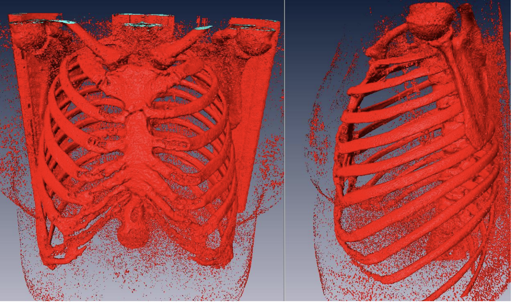
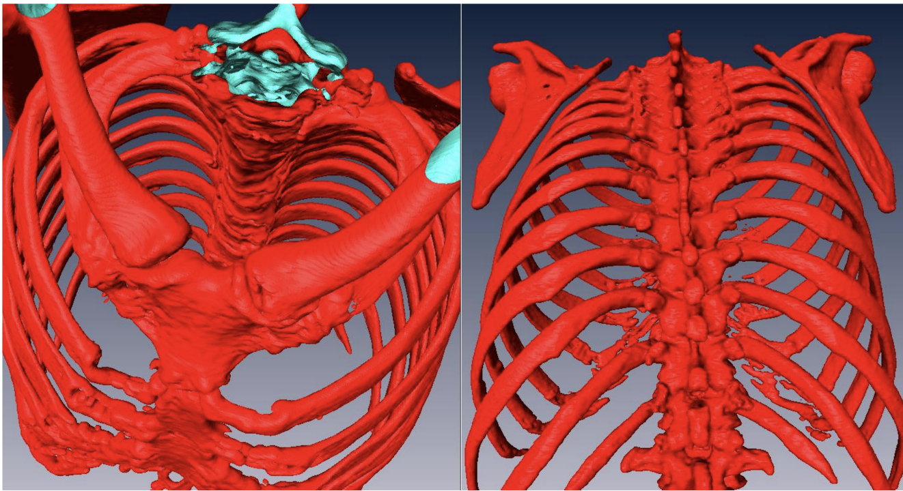
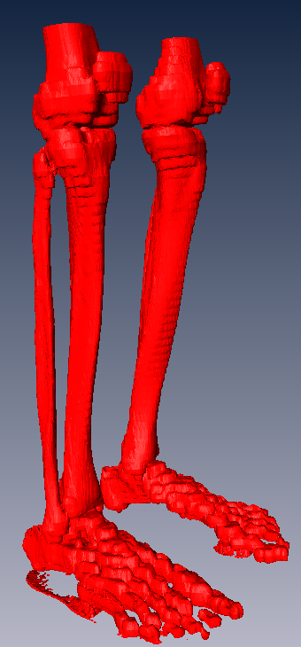

# PyMedBox
The tool provides medical image processing and 3D-model reconstruction via trangulation methods. The repository is a continuation of the old one https://github.com/KirillKazakhmedov/MedBox

## Results

## Overview

The PyMedBox system has the following functions:
- DICOM format medical image processing module;
- A module for reconstructing a 3D model from a series of sequential images using the Marching Cubes algorithm;
- A module for eliminating topological errors in polygonal models;
- A module for smoothing models using the Taubin Smooth algorithm;
- The model decimation module based on the QEM metric (quadric error metric);
- Module for importing/exporting images and models
- [TBD]
